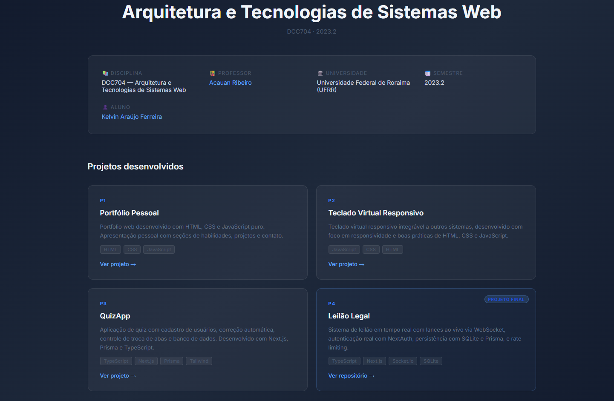

# Arquitetura e Tecnologias de Sistemas Web — DCC704

Repositório com os projetos desenvolvidos na disciplina **DCC704 — Arquitetura e Tecnologias de Sistemas Web**, cursada na **Universidade Federal de Roraima (UFRR)** no semestre **2023.2**.

🔗 **Deploy:** [arquitetura-web-ufrr.vercel.app](https://arquitetura-web-ufrr.vercel.app)

| | |
|---|---|
| 📚 Disciplina | DCC704 — Arquitetura e Tecnologias de Sistemas Web |
| 👨‍🏫 Professor | [Acauan Ribeiro](https://github.com/acauanrr) |
| 🏛️ Universidade | Universidade Federal de Roraima (UFRR) |
| 📅 Semestre | 2023.2 |
| 👤 Aluno | Kelvin Araújo Ferreira |

## Projetos

| # | Projeto | Stack | Pasta |
|---|---------|-------|-------|
| P1 | Portfólio Pessoal | HTML · CSS · JS | [projeto-01-portfolio](./projeto-01-portfolio) |
| P2 | Teclado Virtual Responsivo | JavaScript · CSS · HTML | [projeto-02-teclado](./projeto-02-teclado) |
| P3 | QuizApp | TypeScript · Next.js · Prisma · Tailwind | [projeto-03-quiz](./projeto-03-quiz) |
| P4 | Leilão Legal (Projeto Final) | TypeScript · Next.js · Socket.io · SQLite | [github.com/DilliKel/leilao-legal](https://github.com/DilliKel/leilao-legal) |

## Autor

**Kelvin Araújo Ferreira**
[linkedin.com/in/dillikel](https://linkedin.com/in/dillikel) · [github.com/DilliKel](https://github.com/DilliKel)
